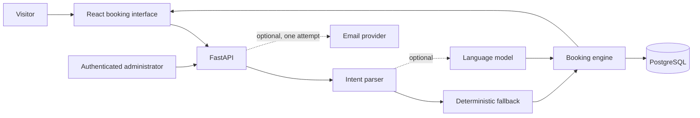

# Doctor Booking Agent

An AI-assisted doctor appointment booking simulation designed as a permanent, low-cost portfolio project.

The application will let a visitor describe a treatment need, preferred doctor, date, and time in natural language. An assistant will interpret the request, search verified availability, offer suitable appointment slots, and create a mock booking after explicit confirmation.

This repository is currently in the **architecture and planning phase**. It intentionally contains no application code yet.

> **Educational simulation only:** This project will not create real medical appointments, provide medical advice, diagnose conditions, or collect medical records. Visitors will be told not to enter personal, medical, or emergency information.

## Project goals

- Demonstrate a practical AI-agent workflow without allowing a model to invent availability or bookings.
- Build a polished, accessible appointment-booking experience using a modern Python and TypeScript stack.
- Keep the public demo at, or very close to, zero operating cost at portfolio traffic levels.
- Use privacy-conscious defaults: synthetic data, no patient accounts, and no stored email addresses.
- Produce a portable Docker image and an automated GitHub Actions delivery pipeline.
- Remain useful when the optional language model is unavailable by retaining deterministic search controls.

## Proposed experience

A visitor might ask:

> I need a sports physiotherapy appointment with Dr Shah next Tuesday after 4 pm.

The system will:

1. Convert the request into validated search criteria.
2. Match the requested service to doctors qualified to provide it.
3. Query PostgreSQL for genuinely available slots.
4. Rank suitable options using transparent application rules.
5. Present the best matches and reasonable alternatives.
6. Require explicit confirmation before creating a mock booking.
7. Return a one-time management token that can cancel the booking.
8. Optionally send one confirmation email without saving the address in the application database.

## Guiding principle

The language model interprets words. The application controls facts and actions.

The model may identify an intent such as `search_appointments` and extract preferences. It may not invent doctors, treatments, availability, prices, booking references, or confirmations. All operational facts come from application code and PostgreSQL.

## Proposed stack

| Area | Technology | Responsibility |
| --- | --- | --- |
| Web interface | React, TypeScript, Vite | Conversational and structured booking experience |
| Styling | Tailwind CSS, accessible component primitives | Responsive visual system and interaction states |
| API | FastAPI | HTTP endpoints, validation, orchestration and administration |
| Domain logic | Python | Treatment matching, availability rules and deterministic ranking |
| Data access | SQLAlchemy 2 and Alembic | Repository layer and schema migrations |
| Database | PostgreSQL, initially hosted on Neon | Doctors, services, slots, bookings and minimal audit state |
| Optional AI | Provider adapter using structured output | Natural-language intent extraction only |
| Packaging | Docker | Reproducible production artifact |
| Local services | Docker Compose | API and PostgreSQL development environment |
| CI/CD | GitHub Actions | Quality checks, tests, image build, smoke test and deployment |
| Runtime | Scale-to-zero container service | Public HTTPS hosting for the Docker image |

The current hosting preference is a scale-to-zero container runtime with Neon PostgreSQL. AWS Lambda with a container image remains a possible AWS-oriented alternative. The application will keep cloud-specific concerns behind deployment configuration.

## System overview



See [Architecture](docs/architecture.md) for component boundaries and request flows.

## Safety and privacy boundaries

- All doctors, clinics, services and appointment data will be synthetic.
- The assistant will map explicitly requested services, not diagnose symptoms.
- Symptom-like requests will receive a neutral clarification and a visible disclaimer.
- The application will not ask for or store medical histories, diagnoses, insurance details or payment information.
- Email confirmation will be optional.
- Email addresses will not be stored in the application database.
- The email delivery provider will necessarily process the address according to its own privacy policy.
- Booking management tokens will be high entropy, returned once and stored only as cryptographic hashes.
- Administrative actions will require authentication and produce a minimal audit record.

See [Data, privacy and security](docs/data-privacy-security.md) for the proposed schema and threat controls.

## Availability and booking integrity

Availability is enforced by PostgreSQL rather than the browser or the model. A unique database constraint will prevent two active bookings from owning the same slot. Booking creation will run in a transaction and return a conflict if another request wins the slot first.

Cancelling a booking will make its slot available again. A visitor can cancel with the management token; an authenticated administrator can remove a booking by reference.

## AI strategy

The baseline application will work without paid AI:

- Structured filters for service, doctor, date and time.
- A deterministic parser for common phrases.
- A service catalogue with explicit aliases.
- Python ranking of verified database results.
- Template-driven clarification and result messages.

An optional model can improve natural-language interpretation using a strict schema such as:

```json
{
  "intent": "search_appointments",
  "service_query": "sports physiotherapy",
  "doctor_name": "Dr Shah",
  "date_expression": "next Tuesday",
  "earliest_time": "16:00",
  "latest_time": null,
  "requires_clarification": false,
  "missing_fields": []
}
```

The API will validate this output before using it. If inference fails, times out, exceeds quota, or returns invalid data, the visitor can continue with deterministic controls.

## Documentation

- [Product scope](docs/product-scope.md)
- [Architecture](docs/architecture.md)
- [Data, privacy and security](docs/data-privacy-security.md)
- [Deployment and operations](docs/deployment-operations.md)
- [Evaluation strategy](docs/evaluation.md)
- [Delivery roadmap](docs/roadmap.md)
- [Architecture decisions](docs/decisions/README.md)

## Planned repository structure

```text
doctor-booking-agent/
├── apps/
│   ├── api/
│   └── web/
├── data/
├── docs/
├── evals/
├── tests/
├── Dockerfile
├── compose.yaml
└── .github/workflows/
```

Only documentation will be committed during the planning milestone. Code scaffolding begins after the architecture decisions and acceptance criteria are reviewed.

## Definition of success

The first public release will be successful when a visitor can:

- Search synthetic availability by service, doctor, date and time.
- Use either natural language or structured controls.
- Receive only valid, currently available suggestions.
- Confirm one mock booking without a race-condition double booking.
- Optionally request one confirmation email.
- Receive and use a private management token to cancel.
- See the slot become unavailable and later available after cancellation.

The project must also pass automated domain tests, agent evaluation cases, container smoke tests, accessibility checks and security scanning.

## Status

**Milestone 0 — planning and architecture.** No implementation has started.

