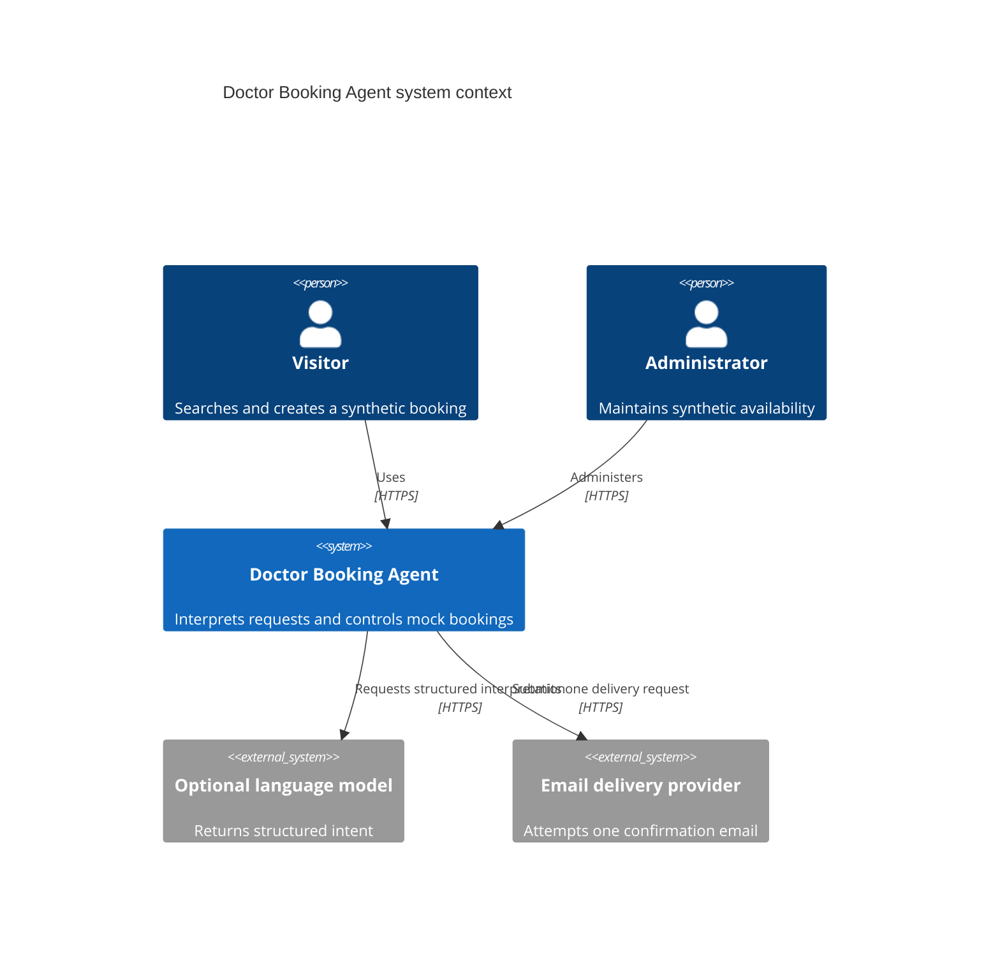
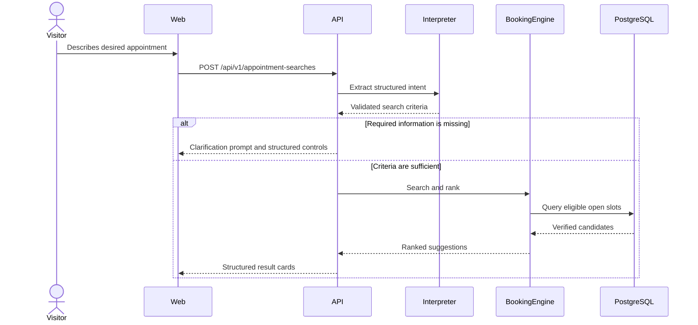

# Architecture

## Architectural style

The project will use a modular monolith: one deployable FastAPI service containing clear domain modules, plus a separately developed React frontend compiled into the production image.

This is intentionally simpler than microservices. Module boundaries preserve future portability without adding distributed-system overhead to a portfolio-scale application.

## Context



## Containers and components

### React web application

Responsibilities:

- Collect natural-language and structured preferences.
- Present clarification questions and verified results.
- Display confirmation, token and cancellation states.
- Provide accessible error and fallback experiences.

It does not decide availability, store secrets or call a model directly.

### FastAPI application

Responsibilities:

- Define the public and administrative HTTP contracts.
- Validate all inbound and model-produced data.
- Coordinate intent interpretation, domain services and repositories.
- Apply authentication, authorization, rate limits and logging policy.
- Serve compiled frontend assets in the production container.

### Intent interpreter

The interpreter exposes one internal interface with two implementations:

- `DeterministicIntentInterpreter`
- `ModelIntentInterpreter`

The model implementation returns structured intent only. Provider-specific SDK objects do not cross the adapter boundary.

### Booking domain

Responsibilities:

- Resolve service eligibility.
- Search and rank slots.
- Validate booking state transitions.
- Commit bookings and cancellations transactionally.
- Generate public references and private management tokens.

The booking domain is independent of FastAPI, React and any model provider.

### Repository layer

Responsibilities:

- Encapsulate PostgreSQL queries.
- Expose transaction-aware domain operations.
- Prevent infrastructure-specific query details leaking into HTTP handlers.

### Administration module

Responsibilities:

- Authenticate administrators.
- List bookings without private token or email data.
- Cancel bookings and manage slot availability.
- Record minimal administrative audit events.

## Search request sequence



## Booking sequence

```mermaid
sequenceDiagram
    actor Visitor
    participant API
    participant PostgreSQL
    participant Email

    Visitor->>API: Confirm slot and optional email
    API->>PostgreSQL: Begin transaction and claim slot
    alt Slot was already taken
        PostgreSQL-->>API: Conflict
        API-->>Visitor: Slot unavailable; offer refreshed results
    else Booking committed
        PostgreSQL-->>API: Booking reference and token hash stored
        opt Email requested
            API->>PostgreSQL: Mark notification attempt claimed
            API->>Email: Submit one confirmation attempt
        end
        API-->>Visitor: Reference and raw token returned once
    end
```

## Proposed HTTP surface

| Method | Path | Purpose |
| --- | --- | --- |
| `POST` | `/api/v1/appointment-searches` | Interpret criteria and return suggestions |
| `GET` | `/api/v1/services` | List the synthetic service catalogue |
| `GET` | `/api/v1/doctors` | List/filter synthetic doctors |
| `GET` | `/api/v1/slots` | Structured availability search |
| `POST` | `/api/v1/bookings` | Confirm one available slot |
| `POST` | `/api/v1/bookings/cancel` | Cancel using a management token |
| `GET` | `/health/live` | Process liveness |
| `GET` | `/health/ready` | Dependency readiness |
| `GET` | `/api/v1/admin/bookings` | Protected booking list |
| `POST` | `/api/v1/admin/bookings/{id}/cancel` | Protected administrative cancellation |

## Ranking policy

PostgreSQL filters invalid candidates. Python ranks the remaining candidates using documented weights:

- Exact requested doctor.
- Exact requested date.
- Membership in the requested time window.
- Distance from a preferred time.
- Soonest appropriate alternative.

The response will identify why each alternative differs. Model-generated scoring is not used.

## Failure behavior

| Failure | Expected behavior |
| --- | --- |
| Model unavailable | Use deterministic parsing and structured controls |
| Invalid model output | Reject it and request clarification |
| Database asleep | Show a retryable temporary-unavailable state |
| Slot race lost | Return conflict and refresh suggestions |
| Email provider failure | Preserve booking; report that email was not confirmed |
| Free quota exhausted | Disable optional integration and preserve core booking flow |

## Deployment shape

The production Docker image will use a multistage build:

1. A Node stage installs locked frontend dependencies and builds static assets.
2. A Python stage installs locked API dependencies.
3. The final non-root runtime contains Python, the API and compiled assets only.

The image will be the single release artifact tested in CI and deployed unchanged.

