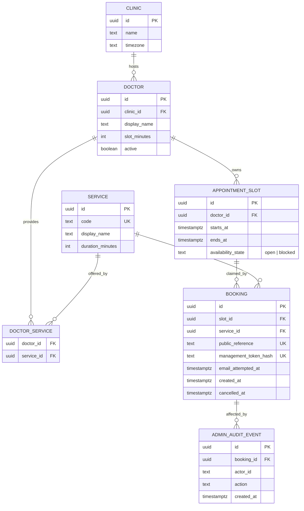

# Data, privacy and security

## Data classification

The application is designed not to collect protected health information. All provider-side catalogue data is synthetic.

| Data | Stored? | Classification | Notes |
| --- | --- | --- | --- |
| Synthetic doctors/services | Yes | Public demo data | Versioned seed source |
| Appointment slots | Yes | Public demo data | Availability changes over time |
| Booking reference | Yes | Low sensitivity | Safe to display; insufficient to cancel |
| Management token | No | Secret | Returned once; only its hash is stored |
| Email address | No | Personal data in transit | Passed to provider for one attempt |
| Email attempt timestamp | Yes | Operational metadata | Contains no address |
| Conversation text | No by default | Potentially sensitive | Avoid application persistence and content logs |
| Administrative identity | Yes, minimal | Security audit data | Required for privileged actions |

## Proposed relational model



Model rules (see [open questions](open-questions.md) 1–3):

- Each doctor has one fixed `slot_minutes`. Every service a doctor provides must fit within one slot, and seed validation rejects any service longer than its doctor's slot length. A booking claims exactly one slot.
- A booking records the service booked. The booking transaction verifies that a `DOCTOR_SERVICE` row exists for the slot's doctor and that service.
- Bookings are the only source of truth for whether a slot is taken. A slot may have many historical bookings but at most one active booking, enforced by a partial unique index:

  ```sql
  CREATE UNIQUE INDEX booking_one_active_per_slot
      ON booking (slot_id)
      WHERE cancelled_at IS NULL;
  ```

- `availability_state` holds administrative state only (`open` or `blocked`) and is never changed by booking or cancellation.
- A slot is bookable when it is `open`, starts in the future and has no active booking. A unique-violation on insert maps to HTTP `409 Conflict`.

## Management token design

- Generate at least 256 bits of cryptographically secure entropy.
- Return the raw token once over HTTPS.
- Store a SHA-256 or keyed-HMAC digest, never the raw value.
- Submit the token in a request body rather than a query string.
- Exclude request bodies and authorization-like values from logs.
- Use constant-time digest comparison where application comparison is required.
- Rate-limit token verification attempts.

The public booking reference is an identifier, not an authenticator.

## Email lifecycle

The intended policy is **at most one application-level delivery attempt**:

1. The user leaves the opt-in checkbox unchecked by default.
2. If checked, the browser sends the email with the confirmation request.
3. FastAPI validates it in memory without logging it.
4. After the booking commits, the database atomically claims the email-attempt state.
5. The address is submitted once to the configured delivery provider.
6. The application discards the address and retains only the attempt timestamp/status.

This favors non-duplication over guaranteed delivery. A network failure may prevent delivery. The interface must not claim that an email was delivered unless the provider confirms acceptance.

The privacy statement must say that the application database does not save the address while the email provider necessarily processes it under its own terms.

## Conversation handling

- Do not persist conversation bodies by default.
- Do not include raw messages in analytics, traces or error reports.
- Add client-side guidance not to enter medical or identifying information.
- Redact obvious email addresses and tokens from structured logs as defense in depth.
- Send the minimum necessary text to an optional model provider.
- Configure provider-side storage controls where available and document their limitations.

## Administrative security

The first release should use a managed identity mechanism rather than application-owned passwords where practical. Administrative routes require:

- Authentication and authorization.
- CSRF protection when cookie-based authentication is used.
- Secure, HTTP-only, same-site cookies where applicable.
- Rate limits and audit events.
- No access to raw tokens or email addresses because neither is stored.

## Threats and controls

| Threat | Control |
| --- | --- |
| Concurrent double booking | Database uniqueness and transaction locking |
| Token guessing | High entropy, hashing and rate limiting |
| Prompt injection | Model cannot execute arbitrary tools; strict schema and allowlisted operations |
| Invented availability | Database is the sole source of operational facts |
| Secret exposure | Server-side secret manager; no browser or repository keys |
| Personal data in logs | Structured metadata-only logging and body exclusion |
| Automated booking abuse | Per-IP/session limits and optional bot challenge |
| Admin misuse | Least privilege and audit events |
| Dependency compromise | Lockfiles, update automation and image scanning |

## Healthcare boundary

This project must not imply compliance with healthcare regulations or suitability for real clinical deployment. Handling real healthcare appointments would require a separate legal, privacy, security and compliance design.

